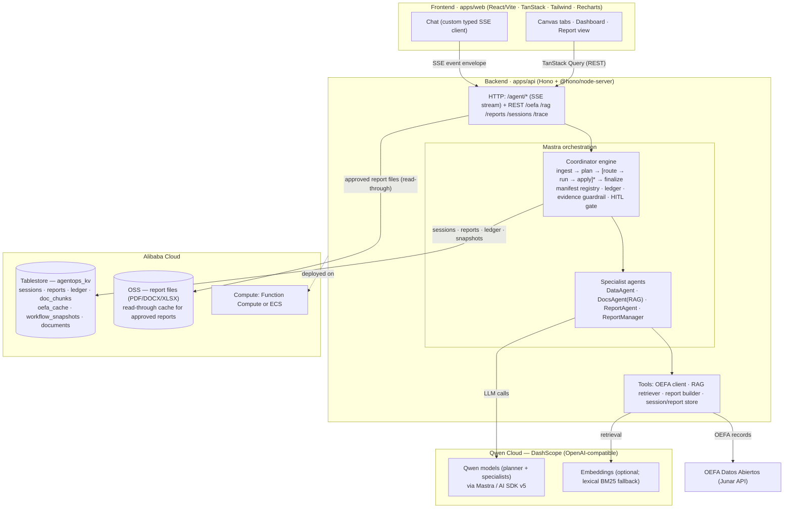

# Architecture

> Rendered architecture diagram for the hackathon submission (compliance item §14 —
> *"Architecture diagram showing how Qwen Cloud connects to backend, DB, frontend"*).
> This reflects the **as-built** system; where it differs from the original
> one-paragraph sketch the difference is noted (custom typed SSE client instead of
> CopilotKit; Hono as the HTTP layer).

## One paragraph

A **React/Vite frontend** (`apps/web`) — TanStack Router/Query + Tailwind + Recharts —
talks to a **Node/TypeScript backend** (`apps/api`, **Hono** + `@hono/node-server`)
over a **streaming `/agent/*` endpoint** (a custom typed Server-Sent-Events envelope)
plus plain REST. The chat layer is a small **custom SSE client** that folds the typed
event stream into chat state — deliberately not CopilotKit, because `/agent/*` speaks
our own typed contract (`packages/shared`). The backend runs a **Mastra orchestration
layer**: one framework-agnostic **Coordinator** (`ingest → plan → [route → run →
apply]* → finalize`) that classifies intent, plans typed tasks, routes each task to a
specialist **Mastra agent** by a **manifest lookup**, runs it, applies a structured
result patch to durable state, enforces an **evidence guardrail**, gates side effects
behind a **HITL approval**, and streams progress. Specialist agents call **tools**
(OEFA Junar client, RAG retriever, report builder, session/report store). The LLM is
**Qwen** on **Qwen Cloud (DashScope, OpenAI-compatible)** via Mastra on the AI SDK v5.
Sessions, reports, the ledger, the OEFA cache, doc chunks and suspend snapshots
persist in **Alibaba Cloud Tablestore**; generated report files (PDF/DOCX/XLSX)
persist to **Alibaba Cloud OSS**. Exporting an **approved** report renders the
file once, stores it in OSS under a canonical key, and serves it from there on
subsequent requests (a read-through cache via the `BlobStore` port; `OssBlobStore`
live, in-memory offline). Every step appends to an **append-only
ledger** that powers both the live task-checklist UI and the after-the-fact
**Trazabilidad** trace. With no credentials the same wiring degrades to an **offline
mode** (seed records, lexical RAG, no-LLM agents) so the whole app is demoable and
testable with zero keys.

## Diagram



## ASCII (fallback)

```
┌───────────────────────── Frontend (apps/web) ───────────────────────────┐
│  Chat (custom typed SSE client) │ Canvas (tabs) │ Dashboard │ Report view │
│        │ stream (typed SSE envelope)        │ TanStack Query (REST)       │
└────────┼────────────────────────────────────┼─────────────────────────────┘
         ▼                                     ▼
┌───────────────────────── Backend (apps/api · Hono) ──────────────────────┐
│  HTTP: /agent/* (SSE) + REST /oefa /rag /reports /sessions /trace         │
│         │                                                                 │
│  ┌──────▼─────────────────── Mastra orchestration ─────────────────────┐ │
│  │  Coordinator:  ingest → plan → [route → run → apply]* → finalize     │ │
│  │     manifest registry (data) · ledger (audit) · evidence guardrail   │ │
│  │     · HITL approval gate · MAX_TASK_STEPS                            │ │
│  │  Specialist agents: DataAgent · DocsAgent(RAG) · ReportAgent ·       │ │
│  │                     ReportManager                                    │ │
│  └──────┬──────────────┬───────────────┬───────────────┬──────────────┘ │
│         ▼              ▼               ▼               ▼                  │
│   OEFA tools     RAG tools      Report tools     Session/Report tools    │
│         │              │               │               │                 │
│  ┌──────▼──────┐  ┌────▼─────┐   ┌─────▼──────┐  ┌──────▼──────────────┐ │
│  │ Junar API   │  │ Embedding│   │ Qwen (Dash │  │ Tablestore          │ │
│  │ datos       │  │ + chunks │   │ Scope) via │  │ (agentops_kv:       │ │
│  │ abiertos    │  │ (lexical │   │ Mastra LLM │  │  sessions, reports, │ │
│  │ OEFA        │  │  default)│   │ provider   │  │  ledger, snapshots…)│ │
│  └─────────────┘  └──────────┘   └────────────┘  │  OSS (report files: │ │
│                                                  │  approved exports)  │ │
│                                                  └─────────────────────┘ │
└──────────────────────────────────────────────────────────────────────────┘
        ▲ Qwen Cloud (DashScope)        ▲ Alibaba Cloud (Tablestore + OSS + FC/ECS)
```

## Alibaba Cloud / Qwen Cloud usage (proof files)

The judging criteria ask for a code file that demonstrably uses Alibaba Cloud
services. These are the seams:

| Concern | File | Service |
| --- | --- | --- |
| LLM provider | `apps/api/src/services/qwen/qwen-provider.ts` | Qwen Cloud (DashScope) |
| Durable state / KV (**exercised end-to-end**) | `apps/api/src/services/storage/tablestore-client.ts` | Alibaba Cloud Tablestore |
| Object storage (**exercised: approved report exports**) | `apps/api/src/services/storage/oss-client.ts`, `apps/api/src/services/report/report-exporter.ts` | Alibaba Cloud OSS |
| Environment-driven wiring | `apps/api/src/http/deps.ts`, `apps/api/src/config/env.ts` | live ⇄ offline switch |

All three sit behind interfaces (`SpecialistAgent`/`Planner`, `DocumentStore`,
`BlobStore`); `buildDeps(env)` selects the live implementation when the matching
credentials are present and the offline equivalent otherwise.

> **OSS on the runtime path:** `GET /reports/:id/export/:fmt` goes through
> `ReportExporter` (`report-exporter.ts`), a read-through cache over the
> `BlobStore`. The first export of an **approved** report renders the file and
> uploads it under `reportFileKey(id, fmt)`; later requests serve the stored
> object. In live mode that store is `OssBlobStore` → Alibaba Cloud OSS; offline
> it is the in-memory store, so the path is identical and fully testable
> (`report-exporter.test.ts`). Draft reports are mutable, so they render fresh and
> are not cached. (Document **uploads** remain a future endpoint.)

See
[`DEPLOY.md`](DEPLOY.md) for provisioning + deployment.
